# Foundations of Computer Security
## Homework Assignment 1
### Divay Prakash - 2014039

<br />
<hr />
<br />

#### Ans 1

**Differences between block ciphers and stream ciphers**

Block cipher | Stream cipher
-------------------------------------- | --------------------------------------
Processing of plain text is done in fixed size blocks | Processing of plain text is done bit-by-bit
Same key is used to encrypt each block | Different key is used to encrypt each bit, it is an infinite stream of pseudorandom bits
Same plain text with same key will give same cipher text | Same plain text with same key will give different cipher text
More complex and slower | Very simple and much faster
Ex. DES, IDEA, Blowfish, RC5 | Ex. FISH, RC4

**Encryption using block and stream ciphers**

Plain text : FOUNDATIONS TO COMPUTER SECURITY IS A COURSE AT IIITD

Encrypted using DES (block cipher) in ECB (electronic code book) mode with key
`139AD0472BE4F25C` :
```
da a7 a5 32 99 c9 19 06 ac 32 12 9c 96 45 6d ad
a1 4e f3 1e 4b 0e 7c e2 90 77 72 a0 30 73 2d dc
a5 dd a8 09 bd 9c 65 a9 92 ce 04 51 17 87 02 b7
4a 34 79 f0 35 9c d9 ec
```
Encrypted using RC4 (stream cipher) with key `139AD0472BE4F25C` :
```
45 90 43 f2 4d 63 a5 03 49 44 78 7d d8 48 e8 4e
2c 45 a0 e4 ff 3a 45 af a9 8d d7 45 5b d4 40 7a
b3 d6 71 e9 00 f1 89 ef 62 a5 94 cb 0e 47 54 6f
0a 22 4a be a0
```

#### Ans 2

**NMap**

I used Ubuntu 16.04.1 to run NMap. I ran the following scans :
* `-sS`: TCP syn scan
* `-sT`: TCP connect scan
* `-sV`: Service/version detection
* `-P0`: No ping scan
* `-O`: OS detection scan

The basic command for each scan was of the format :
```
nmap 'scan_flag' -vv -p 0-65535 localhost
```
An explanation of the flags used :
* `-vv` : very verbose output
* `-p` : this flag alongwith the corresponding `0-65535` option specifies the
port range on which to run the NMap scan, here it is the complete range

The `localhost` option specifies the scan is to be run on the host machine
itself.

I obtained similar results for the NMap scans whether the system firewall was
turned off or on. This can be seen in the attached screenshots.

**TCP syn scan**
<br />
```
nmap -sS -vv -p 0-65535 localhost
```
##### Firewall **OFF**
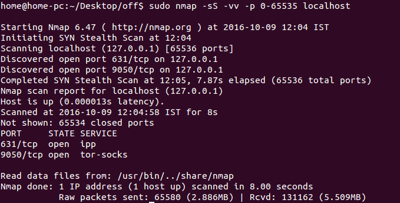
##### Firewall **ON**
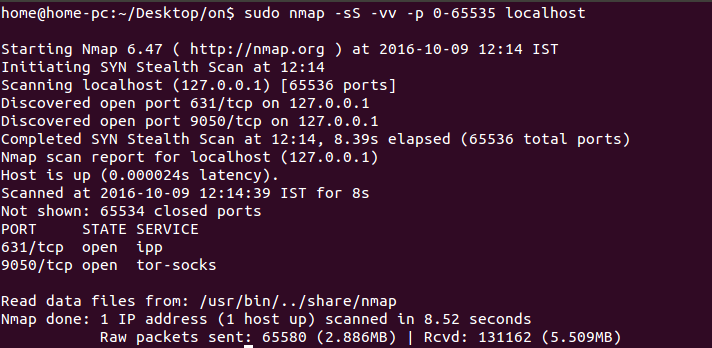

**TCP connect scan**
<br />
```
nmap -sT -vv -p 0-65535 localhost
```
##### Firewall **OFF**
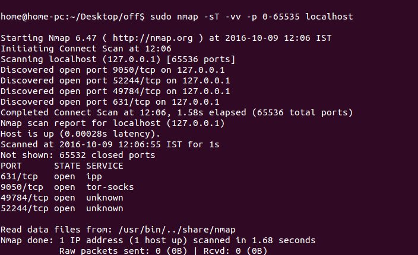
##### Firewall **ON**
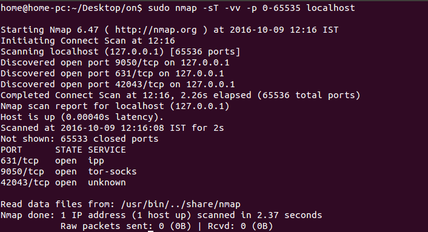

**Service/version detection scan**
<br />
```
nmap -sV -vv -p 0-65535 localhost
```
##### Firewall **OFF**
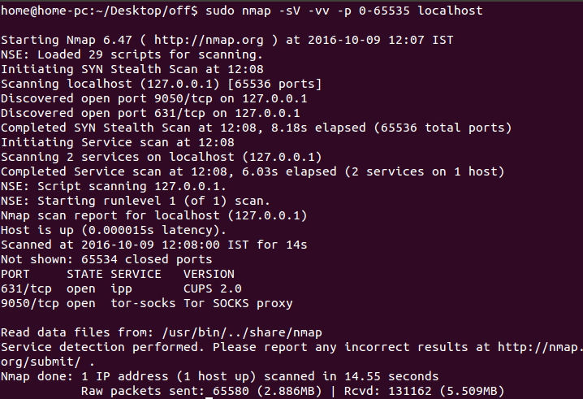
##### Firewall **ON**
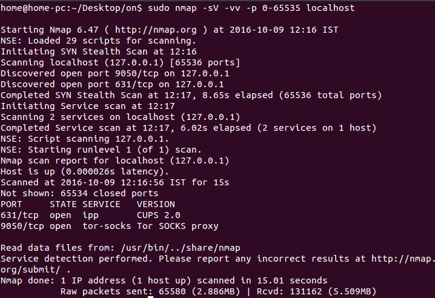

**No ping scan**
<br />
```
nmap -P0 -vv -p 0-65535 localhost
```
##### Firewall **OFF**
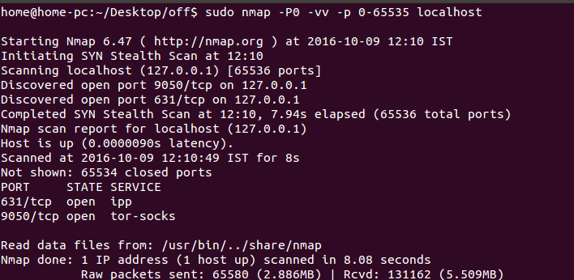
##### Firewall **ON**
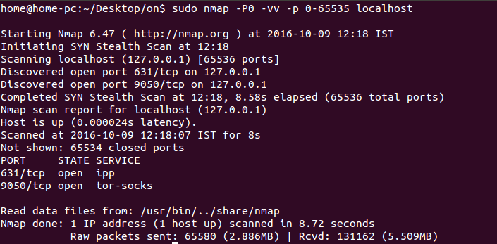

**OS detection scan**
<br />
```
nmap -O -vv -p 0-65535 localhost
```
##### Firewall **OFF**
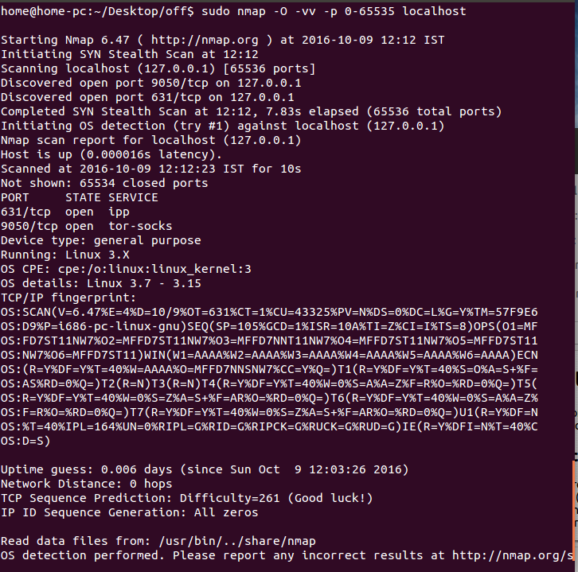
##### Firewall **ON**
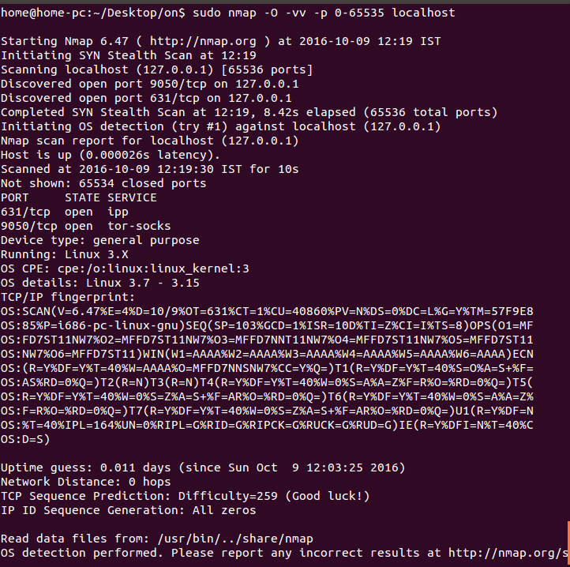

### Ans 3

**Heartbleed**

The [Heartbleed Bug](http://heartbleed.com/) is a vulnerability in the OpenSSL
cryptographic software library. It was introduced to the OpenSSL library code
in December 2011 and released for use on 14th of March 2012 with OpenSSL
release `1.0.1`. It was patched with the release of version `1.0.1g` on 7th of
April 2014. The bug was created due to a programming error in the
implementation of the TLS/DTLS (transport layer security protocols) **heartbeat**
extension. The error is an improper input validation due to a missing bounds
check. The vulnerability is thus classified as a buffer over-read, a situation
where more data can be read than is allowed. The data compromised due to this
bug includes :
* secret (ie. private) encryption keys
* user credentials such as usernames and passowords
* contents of the encrypted messages such as personal or financial details etc.
* technical details in the leaked memory content

As OpenSSL is the most popular TLS implementation, the bug affected a vast
majority of all clients and servers on the World Wide Web. There is also no way
to detect if an attacker has used this exploit against a client/server.

The bug was discovered independently by security engineers at Codenomicon and
Google Security. Heartbleed is also classified as a **zero-day exploit**,
a bug that is exploited by attackers before a developer has an opportunity to
create a patch to fix the vulnerability.

**Test for vulnerability**

I chose the [Zen Audio Player](http://zenplayer.audio) website to test for
heartbleed vulnerability. The process involved using the `nslookup` tool to
retrieve the IP address of the website and then using NMap runnning the
`ssl-heartbleed` script.

The output obtained is as follows :

##### Command 1
```
nslookup zenplayer.audio
```
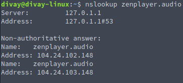

##### Command 2
```
nmap -script=ssl-heartbleed --script-args vulns.showall -sV 104.24.102.148
```

Explanation of command line arguments :
* `--script ssl-heartbleed`: select the `ssl-heartbleed` script to run on
appropriate ports
* `--script-args vulns.showall`: tells the script to output "NOT VULNERABLE"
when it does not detect the vulnerability
* `-sV`: requests a service version detection scan, which will allow the script
to run against unusual ports that support SSL

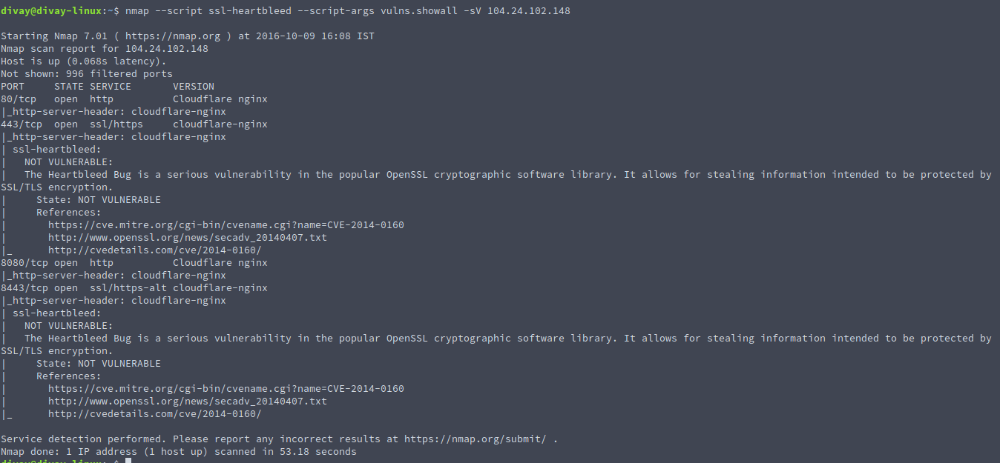

As we can see in the output, the website is not vulnerable to Heartbleed.

### Ans 4

**Threat Model of IIIT Delhi library**

#### Assets

* User credentials - students, faculty etc.
* Admin credentials - library staff
* User data - reading hstory, issue history, renewals etc.
* Library website server
* Library database server
* Physical assets
	* Books
	* Furniture
	* Computer systems

#### Points of attack

* Computer systems installed in library to help students/faculty locate books
to issue could be attacked. Ex. keyloggers to record user credentials, script/
code execution to gain access to library server
* Process of issuing books could be exploited as librarians issue books to any
student on another student's ID card
* Absence of staff at library counter could be exploited as their systems have
higher trust level
* Theft of computer hardware : The external peripherals connected to computer systems can be removed and stolen
* RFID tags on books can be torn off as they are enclosed in only a sticker,
thus allowing anyone to carry out the books un-issued
* Non-functioning door scanners could be used to steal books

#### Mitigatiom

* Stricter vigilance by library staff and presence at counter
* Issuing books only to students on their own ID card
* Tigther security on computer systems for eg. locing screen to IIIT library
website
* Securing peripherals with wire ties to prevent theft
* Attaching RFID tags more securely to books

#### Effect on usability

* All the suggested measures would put more burden on the library staff,
however security would be greatly increased

**Threat model of IIIT Delhi ERP**

#### Assets
* User credentials - students, faculty etc.
* Admin credentials - staff
* User data
	* Students : grades, fees, course registration, hostel request etc.
	* Faculty data
* ERP website server
* ERP database server

#### Points of attack
* DoS (Denial of service) attack on ERP website
* Issues with payment gateway security could be exploited by attackers
* Inability to access outside IIIT network is a major issue

#### Mitigation
* Tighter security for servers
* Data encryption before storage
* Providing access to ERP outside IIIT network

#### Effect on usability

* All the suggested measures would entail more work for the management staff,
howvever users would greatly benefit

### Ans 5

I used the following Python code to decrypt the cipher text :

```python
from Crypto.Cipher import DES
import string
print "Start time : ", start_time

cipher_text = "\xc5\x81\x97~\xb4\x0b:U\x13^\x9c\xb2:\xedcC\xe5\n\xab\xb2\xbas \
\xbe/\r\xa8\x00'\x87\x91Ch\xb8\x060\xfb\xf8V\xf7)\x1d\xfb\x12\xe7\x16\xf0\x12 \
\x1dQ\x99Gs`\xf5qZjQL\xe1\x1f\xfd\x90E"
count = 0

for key_root in xrange(0, 100000000):
	key = ""
	n = key_root
	while(n > 0):
		key = str(n%10) + key
		n = n/10 
	if (len(key) < 8):
		for key_root in xrange(len(key), 8):
			key = '0' + key
	des = DES.new(key, DES.MODE_ECB)
	decrypted_text = des.decrypt(cipher_text)
	if all(c in string.printable for c in decrypted_text):
		print key,decrypted_text
		count += 1

print "Number of keys : ", count
end_time = time.time()
print "End time : ", end_time
print "Total time taken in decryption (in sec) : ", end_time-start_time

```

I used the [PyCrypto](https://www.dlitz.net/software/pycrypto/) library.
In addition, I filtered the decrypted text outputs checking if each character in
the output string was printable.

The output obtained was as below :
> divay@divay-linux:~$ python script.py<br />
>Start time : 1475877337.31<br />
>64402222 We are all in the gutter but some of us are looking at the stars<br />
>64402223 We are all in the gutter but some of us are looking at the stars<br />
>64402232 We are all in the gutter but some of us are looking at the stars<br />
>64402233 We are all in the gutter but some of us are looking at the stars<br />
>64402322 We are all in the gutter but some of us are looking at the stars<br />
>64402323 We are all in the gutter but some of us are looking at the stars<br />
>64402332 We are all in the gutter but some of us are looking at the stars<br />
>64402333 We are all in the gutter but some of us are looking at the stars<br />
>64403222 We are all in the gutter but some of us are looking at the stars<br />
>64403223 We are all in the gutter but some of us are looking at the stars<br />
>64403232 We are all in the gutter but some of us are looking at the stars<br />
>64403233 We are all in the gutter but some of us are looking at the stars<br />
>64403322 We are all in the gutter but some of us are looking at the stars<br />
>64403323 We are all in the gutter but some of us are looking at the stars<br />
>64403332 We are all in the gutter but some of us are looking at the stars<br />
>64403333 We are all in the gutter but some of us are looking at the stars<br />
>64412222 We are all in the gutter but some of us are looking at the stars<br />
>64412223 We are all in the gutter but some of us are looking at the stars<br />
>64412232 We are all in the gutter but some of us are looking at the stars<br />
>64412233 We are all in the gutter but some of us are looking at the stars<br />
>64412322 We are all in the gutter but some of us are looking at the stars<br />
>64412323 We are all in the gutter but some of us are looking at the stars<br />
>64412332 We are all in the gutter but some of us are looking at the stars<br />
>64412333 We are all in the gutter but some of us are looking at the stars<br />
>64413222 We are all in the gutter but some of us are looking at the stars<br />
>64413223 We are all in the gutter but some of us are looking at the stars<br />
>64413232 We are all in the gutter but some of us are looking at the stars<br />
>64413233 We are all in the gutter but some of us are looking at the stars<br />
>64413322 We are all in the gutter but some of us are looking at the stars<br />
>64413323 We are all in the gutter but some of us are looking at the stars<br />
>64413332 We are all in the gutter but some of us are looking at the stars<br />
>64413333 We are all in the gutter but some of us are looking at the stars<br />
>64502222 We are all in the gutter but some of us are looking at the stars<br />
>64502223 We are all in the gutter but some of us are looking at the stars<br />
>64502232 We are all in the gutter but some of us are looking at the stars<br />
>64502233 We are all in the gutter but some of us are looking at the stars<br />
>64502322 We are all in the gutter but some of us are looking at the stars<br />
>64502323 We are all in the gutter but some of us are looking at the stars<br />
>64502332 We are all in the gutter but some of us are looking at the stars<br />
>64502333 We are all in the gutter but some of us are looking at the stars<br />
>64503222 We are all in the gutter but some of us are looking at the stars<br />
>64503223 We are all in the gutter but some of us are looking at the stars<br />
>64503232 We are all in the gutter but some of us are looking at the stars<br />
>64503233 We are all in the gutter but some of us are looking at the stars<br />
>64503322 We are all in the gutter but some of us are looking at the stars<br />
>64503323 We are all in the gutter but some of us are looking at the stars<br />
>64503332 We are all in the gutter but some of us are looking at the stars<br />
>64503333 We are all in the gutter but some of us are looking at the stars<br />
>64512222 We are all in the gutter but some of us are looking at the stars<br />
>64512223 We are all in the gutter but some of us are looking at the stars<br />
>64512232 We are all in the gutter but some of us are looking at the stars<br />
>64512233 We are all in the gutter but some of us are looking at the stars<br />
>64512322 We are all in the gutter but some of us are looking at the stars<br />
>64512323 We are all in the gutter but some of us are looking at the stars<br />
>64512332 We are all in the gutter but some of us are looking at the stars<br />
>64512333 We are all in the gutter but some of us are looking at the stars<br />
>64513222 We are all in the gutter but some of us are looking at the stars<br />
>64513223 We are all in the gutter but some of us are looking at the stars<br />
>64513232 We are all in the gutter but some of us are looking at the stars<br />
>64513233 We are all in the gutter but some of us are looking at the stars<br />
>64513322 We are all in the gutter but some of us are looking at the stars<br />
>64513323 We are all in the gutter but some of us are looking at the stars<br />
>64513332 We are all in the gutter but some of us are looking at the stars<br />
>64513333 We are all in the gutter but some of us are looking at the stars<br />
>65402222 We are all in the gutter but some of us are looking at the stars<br />
>65402223 We are all in the gutter but some of us are looking at the stars<br />
>65402232 We are all in the gutter but some of us are looking at the stars<br />
>65402232 We are all in the gutter but some of us are looking at the stars<br />
>65402233 We are all in the gutter but some of us are looking at the stars<br />
>65402322 We are all in the gutter but some of us are looking at the stars<br />
>65402323 We are all in the gutter but some of us are looking at the stars<br />
>65402332 We are all in the gutter but some of us are looking at the stars<br />
>65402333 We are all in the gutter but some of us are looking at the stars<br />
>65403222 We are all in the gutter but some of us are looking at the stars<br />
>65403223 We are all in the gutter but some of us are looking at the stars<br />
>65403232 We are all in the gutter but some of us are looking at the stars<br />
>65403233 We are all in the gutter but some of us are looking at the stars<br />
>65403322 We are all in the gutter but some of us are looking at the stars<br />
>65403323 We are all in the gutter but some of us are looking at the stars<br />
>65403332 We are all in the gutter but some of us are looking at the stars<br />
>65403333 We are all in the gutter but some of us are looking at the stars<br />
>65412222 We are all in the gutter but some of us are looking at the stars<br />
>65412222 We are all in the gutter but some of us are looking at the stars<br />
>65412223 We are all in the gutter but some of us are looking at the stars<br />
>65412232 We are all in the gutter but some of us are looking at the stars<br />
>65412233 We are all in the gutter but some of us are looking at the stars<br />
>65412322 We are all in the gutter but some of us are looking at the stars<br />
>65412323 We are all in the gutter but some of us are looking at the stars<br />
>65412332 We are all in the gutter but some of us are looking at the stars<br />
>65412333 We are all in the gutter but some of us are looking at the stars<br />
>65413222 We are all in the gutter but some of us are looking at the stars<br />
>65413223 We are all in the gutter but some of us are looking at the stars<br />
>65413232 We are all in the gutter but some of us are looking at the stars<br />
>65413233 We are all in the gutter but some of us are looking at the stars<br />
>65413322 We are all in the gutter but some of us are looking at the stars<br />
>65413323 We are all in the gutter but some of us are looking at the stars<br />
>65413332 We are all in the gutter but some of us are looking at the stars<br />
>65413333 We are all in the gutter but some of us are looking at the stars<br />
>65502222 We are all in the gutter but some of us are looking at the stars<br />
>65502223 We are all in the gutter but some of us are looking at the stars<br />
>65502232 We are all in the gutter but some of us are looking at the stars<br />
>65502233 We are all in the gutter but some of us are looking at the stars<br />
>65502322 We are all in the gutter but some of us are looking at the stars<br />
>65502323 We are all in the gutter but some of us are looking at the stars<br />
>65502332 We are all in the gutter but some of us are looking at the stars<br />
>65502333 We are all in the gutter but some of us are looking at the stars<br />
>65503222 We are all in the gutter but some of us are looking at the stars<br />
>65503223 We are all in the gutter but some of us are looking at the stars<br />
>65503232 We are all in the gutter but some of us are looking at the stars<br />
>65503233 We are all in the gutter but some of us are looking at the stars<br />
>65503322 We are all in the gutter but some of us are looking at the stars<br />
>65503323 We are all in the gutter but some of us are looking at the stars<br />
>65503332 We are all in the gutter but some of us are looking at the stars<br />
>65503333 We are all in the gutter but some of us are looking at the stars<br />
>65512222 We are all in the gutter but some of us are looking at the stars<br />
>65512223 We are all in the gutter but some of us are looking at the stars<br />
>65512232 We are all in the gutter but some of us are looking at the stars<br />
>65512233 We are all in the gutter but some of us are looking at the stars<br />
>65512322 We are all in the gutter but some of us are looking at the stars<br />
>65512323 We are all in the gutter but some of us are looking at the stars<br />
>65512332 We are all in the gutter but some of us are looking at the stars<br />
>65512333 We are all in the gutter but some of us are looking at the stars<br />
>65513222 We are all in the gutter but some of us are looking at the stars<br />
>65513223 We are all in the gutter but some of us are looking at the stars<br />
>65513232 We are all in the gutter but some of us are looking at the stars<br />
>65513233 We are all in the gutter but some of us are looking at the stars<br />
>65513322 We are all in the gutter but some of us are looking at the stars<br />
>65513323 We are all in the gutter but some of us are looking at the stars<br />
>65513332 We are all in the gutter but some of us are looking at the stars<br />
>65513333 We are all in the gutter but some of us are looking at the stars<br />
>74402222 We are all in the gutter but some of us are looking at the stars<br />
>74402223 We are all in the gutter but some of us are looking at the stars<br />
>74402232 We are all in the gutter but some of us are looking at the stars<br />
>74402233 We are all in the gutter but some of us are looking at the stars<br />
>74402322 We are all in the gutter but some of us are looking at the stars<br />
>74402323 We are all in the gutter but some of us are looking at the stars<br />
>74402332 We are all in the gutter but some of us are looking at the stars<br />
>74402333 We are all in the gutter but some of us are looking at the stars<br />
>74403222 We are all in the gutter but some of us are looking at the stars<br />
>74403223 We are all in the gutter but some of us are looking at the stars<br />
>74403232 We are all in the gutter but some of us are looking at the stars<br />
>74403233 We are all in the gutter but some of us are looking at the stars<br />
>74403322 We are all in the gutter but some of us are looking at the stars<br />
>74403323 We are all in the gutter but some of us are looking at the stars<br />
>74403332 We are all in the gutter but some of us are looking at the stars<br />
>74403333 We are all in the gutter but some of us are looking at the stars<br />
>74412222 We are all in the gutter but some of us are looking at the stars<br />
>74412223 We are all in the gutter but some of us are looking at the stars<br />
>74412232 We are all in the gutter but some of us are looking at the stars<br />
>74412233 We are all in the gutter but some of us are looking at the stars<br />
>74412322 We are all in the gutter but some of us are looking at the stars<br />
>74412323 We are all in the gutter but some of us are looking at the stars<br />
>74412332 We are all in the gutter but some of us are looking at the stars<br />
>74412333 We are all in the gutter but some of us are looking at the stars<br />
>74413222 We are all in the gutter but some of us are looking at the stars<br />
>74413223 We are all in the gutter but some of us are looking at the stars<br />
>74413232 We are all in the gutter but some of us are looking at the stars<br />
>74413233 We are all in the gutter but some of us are looking at the stars<br />
>74413322 We are all in the gutter but some of us are looking at the stars<br />
>74413323 We are all in the gutter but some of us are looking at the stars<br />
>74413332 We are all in the gutter but some of us are looking at the stars<br />
>74413333 We are all in the gutter but some of us are looking at the stars<br />
>74502222 We are all in the gutter but some of us are looking at the stars<br />
>74502223 We are all in the gutter but some of us are looking at the stars<br />
>74502232 We are all in the gutter but some of us are looking at the stars<br />
>74502233 We are all in the gutter but some of us are looking at the stars<br />
>74502322 We are all in the gutter but some of us are looking at the stars<br />
>74502323 We are all in the gutter but some of us are looking at the stars<br />
>74502332 We are all in the gutter but some of us are looking at the stars<br />
>74502333 We are all in the gutter but some of us are looking at the stars<br />
>74503222 We are all in the gutter but some of us are looking at the stars<br />
>74503223 We are all in the gutter but some of us are looking at the stars<br />
>74503232 We are all in the gutter but some of us are looking at the stars<br />
>74503233 We are all in the gutter but some of us are looking at the stars<br />
>74503322 We are all in the gutter but some of us are looking at the stars<br />
>74503323 We are all in the gutter but some of us are looking at the stars<br />
>74503332 We are all in the gutter but some of us are looking at the stars<br />
>74503333 We are all in the gutter but some of us are looking at the stars<br />
>74512222 We are all in the gutter but some of us are looking at the stars<br />
>74512223 We are all in the gutter but some of us are looking at the stars<br />
>74512232 We are all in the gutter but some of us are looking at the stars<br />
>74512233 We are all in the gutter but some of us are looking at the stars<br />
>74512322 We are all in the gutter but some of us are looking at the stars<br />
>74512323 We are all in the gutter but some of us are looking at the stars<br />
>74512332 We are all in the gutter but some of us are looking at the stars<br />
>74512333 We are all in the gutter but some of us are looking at the stars<br />
>74513222 We are all in the gutter but some of us are looking at the stars<br />
>74513223 We are all in the gutter but some of us are looking at the stars<br />
>74513232 We are all in the gutter but some of us are looking at the stars<br />
>74513233 We are all in the gutter but some of us are looking at the stars<br />
>74513322 We are all in the gutter but some of us are looking at the stars<br />
>74513323 We are all in the gutter but some of us are looking at the stars<br />
>74513332 We are all in the gutter but some of us are looking at the stars<br />
>74513333 We are all in the gutter but some of us are looking at the stars<br />
>75402222 We are all in the gutter but some of us are looking at the stars<br />
>75402223 We are all in the gutter but some of us are looking at the stars<br />
>75402232 We are all in the gutter but some of us are looking at the stars<br />
>75402233 We are all in the gutter but some of us are looking at the stars<br />
>75402322 We are all in the gutter but some of us are looking at the stars<br />
>75402323 We are all in the gutter but some of us are looking at the stars<br />
>75402332 We are all in the gutter but some of us are looking at the stars<br />
>75402333 We are all in the gutter but some of us are looking at the stars<br />
>75403222 We are all in the gutter but some of us are looking at the stars<br />
>75403223 We are all in the gutter but some of us are looking at the stars<br />
>75403232 We are all in the gutter but some of us are looking at the stars<br />
>75403233 We are all in the gutter but some of us are looking at the stars<br />
>75403322 We are all in the gutter but some of us are looking at the stars<br />
>75403323 We are all in the gutter but some of us are looking at the stars<br />
>75403332 We are all in the gutter but some of us are looking at the stars<br />
>75403333 We are all in the gutter but some of us are looking at the stars<br />
>75412222 We are all in the gutter but some of us are looking at the stars<br />
>75412223 We are all in the gutter but some of us are looking at the stars<br />
>75412232 We are all in the gutter but some of us are looking at the stars<br />
>75412233 We are all in the gutter but some of us are looking at the stars<br />
>75412322 We are all in the gutter but some of us are looking at the stars<br />
>75412323 We are all in the gutter but some of us are looking at the stars<br />
>75412332 We are all in the gutter but some of us are looking at the stars<br />
>75412333 We are all in the gutter but some of us are looking at the stars<br />
>75413222 We are all in the gutter but some of us are looking at the stars<br />
>75413223 We are all in the gutter but some of us are looking at the stars<br />
>75413232 We are all in the gutter but some of us are looking at the stars<br />
>75413233 We are all in the gutter but some of us are looking at the stars<br />
>75413322 We are all in the gutter but some of us are looking at the stars<br />
>75413323 We are all in the gutter but some of us are looking at the stars<br />
>75413332 We are all in the gutter but some of us are looking at the stars<br />
>75413333 We are all in the gutter but some of us are looking at the stars<br />
>75502222 We are all in the gutter but some of us are looking at the stars<br />
>75502223 We are all in the gutter but some of us are looking at the stars<br />
>75502232 We are all in the gutter but some of us are looking at the stars<br />
>75502233 We are all in the gutter but some of us are looking at the stars<br />
>75502322 We are all in the gutter but some of us are looking at the stars<br />
>75502323 We are all in the gutter but some of us are looking at the stars<br />
>75502332 We are all in the gutter but some of us are looking at the stars<br />
>75502333 We are all in the gutter but some of us are looking at the stars<br />
>75503222 We are all in the gutter but some of us are looking at the stars<br />
>75503223 We are all in the gutter but some of us are looking at the stars<br />
>75503232 We are all in the gutter but some of us are looking at the stars<br />
>75503233 We are all in the gutter but some of us are looking at the stars<br />
>75503322 We are all in the gutter but some of us are looking at the stars<br />
>75503323 We are all in the gutter but some of us are looking at the stars<br />
>75503332 We are all in the gutter but some of us are looking at the stars<br />
>75503333 We are all in the gutter but some of us are looking at the stars<br />
>75512222 We are all in the gutter but some of us are looking at the stars<br />
>75512223 We are all in the gutter but some of us are looking at the stars<br />
>75512232 We are all in the gutter but some of us are looking at the stars<br />
>75512233 We are all in the gutter but some of us are looking at the stars<br />
>75512322 We are all in the gutter but some of us are looking at the stars<br />
>75512323 We are all in the gutter but some of us are looking at the stars<br />
>75512332 We are all in the gutter but some of us are looking at the stars<br />
>75512333 We are all in the gutter but some of us are looking at the stars<br />
>75513222 We are all in the gutter but some of us are looking at the stars<br />
>75513223 We are all in the gutter but some of us are looking at the stars<br />
>75513232 We are all in the gutter but some of us are looking at the stars<br />
>75513233 We are all in the gutter but some of us are looking at the stars<br />
>75513322 We are all in the gutter but some of us are looking at the stars<br />
>75513323 We are all in the gutter but some of us are looking at the stars<br />
>75513332 We are all in the gutter but some of us are looking at the stars<br />
>75513333 We are all in the gutter but some of us are looking at the stars<br />
>Number of keys : 256<br />
>End time : 1475878553.9<br />
>Total time taken in decryption (in sec) : 1216.58328915<br />

<br>
<hr>
<br>

